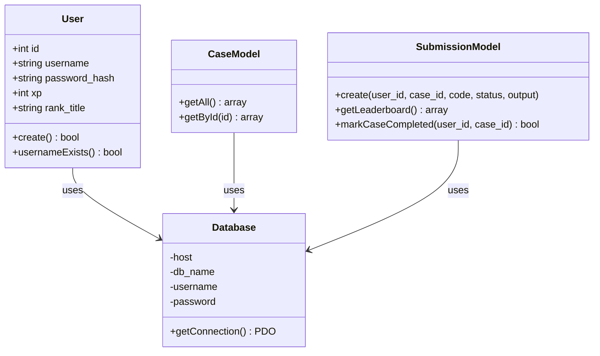
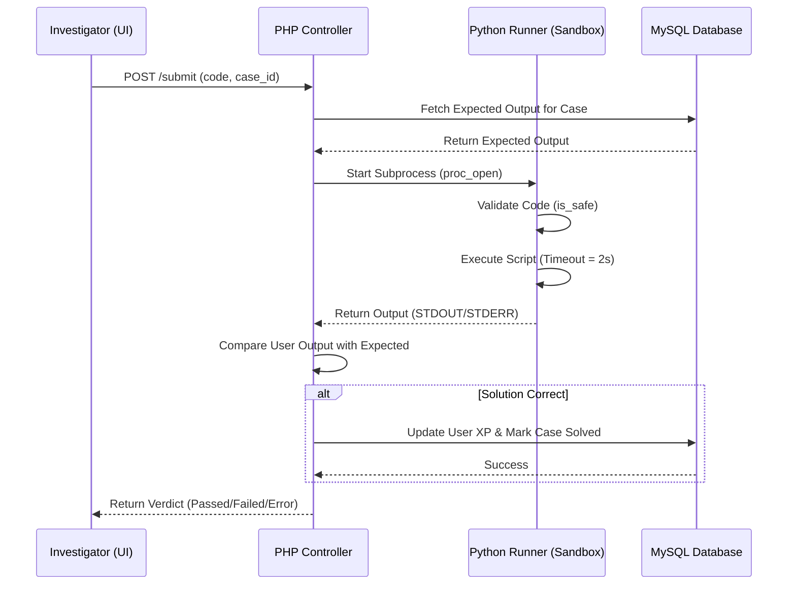
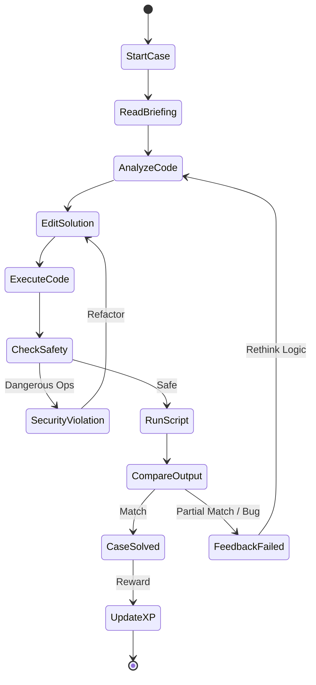

# 📄 Software Requirement Specification (SRS) & Design Document
## Project: Python Detective Game
**Project Category**: Full-Stack Educational Gamification Platform
**Level**: NIELIT A Level Major Project

---

## 1. System Overview
The Python Detective Game is a multi-tier web application designed to teach Python programming through narrative-driven deduction. It employs a **React** frontend for an immersive user experience, a **PHP REST API** for business logic, and a **Python-based Micro-Sandbox** for secure code execution.

---

## 2. Use Case Diagram
Describes the functional requirements from the perspective of the Investigator (User).

```mermaid
useCaseDiagram
    actor Investigator as "Investigator (Player)"
    actor Admin as "Database Admin"

    package "Python Detective System" {
        usecase UC1 as "Register / Create Profile"
        usecase UC2 as "Login / Authenticate"
        usecase UC3 as "Browse Case Files"
        usecase UC4 as "Investigate Evidence (Briefing/Hints)"
        usecase UC5 as "Write & Execute Python Code"
        usecase UC6 as "Submit Verdict (Comparison)"
        usecase UC7 as "View Global Leaderboard"
        usecase UC8 as "Manage Cases (SQL Seed)"
    }

    Investigator --> UC1
    Investigator --> UC2
    Investigator --> UC3
    Investigator --> UC4
    Investigator --> UC5
    Investigator --> UC6
    Investigator --> UC7
    
    Admin --> UC8
```

---

## 3. System Architecture (Component Diagram)
The system follows a decoupled Client-Server architecture.

```mermaid
componentDiagram
    package "Client Tier (Frontend)" {
        [React Application] <<UI>>
        [Auth Context] <<State Manager>>
        [Axios Client] <<Service>>
    }

    package "Logic Tier (Backend API)" {
        [PHP Controller] <<Logic>>
        [PHP Model] <<Data Access>>
        [CORS/Utility] <<Helper>>
    }

    package "Execution Tier (Engine)" {
        [Python Runner] <<Sandbox>>
    }

    database "Data Tier" {
        [MySQL Database] <<Storage>>
    }

    [React Application] --> [Axios Client]
    [Axios Client] -- REST/JSON --> [PHP Controller]
    [PHP Controller] --> [PHP Model]
    [PHP Model] --> [MySQL Database]
    [PHP Controller] -- proc_open --> [Python Runner]
```

---

## 4. Class Diagram
Represents the Object-Oriented structure of the Backend API.



---

## 5. Sequence Diagram: Code Submission Flow
Illustrates the chronological interaction between components during a solution attempt.



---

## 6. Activity Diagram: Game Logic Loop
Detailed logic flow for resolving a detective case.



---

## 7. Deployment Diagram
Hardware and software mapping for the production/development environment.

```mermaid
deploymentDiagram
    node "User Device" {
        [Web Browser] <<Client Runtime>>
    }

    node "Web Server (XAMPP/NGINX)" {
        [PHP 8.0 Interpreter]
        [Vite Dev Server (Node.js)]
    }

    node "Storage Server" {
        database "MySQL Instance"
    }

    node "Sandbox Node" {
        [Python 3.13 Runtime]
    }

    [Web Browser] -- HTTP/HTTPS --> [Vite Dev Server (Node.js)]
    [Vite Dev Server (Node.js)] -- FastCGI --> [PHP 8.0 Interpreter]
    [PHP 8.0 Interpreter] -- TCP/IP (3306) --> [MySQL Instance]
    [PHP 8.0 Interpreter] -- Shell Execution --> [Python 3.13 Runtime]
```

---

## 8. Development & Planning
- **Phase 1: Database Design**: Implementation of `schema.sql` (Users, Cases, Submissions).
- **Phase 2: Backend Development**: Building the PHP REST API with MVC patterns.
- **Phase 3: Sandbox Engineering**: Creating `runner.py` with security restrictions.
- **Phase 4: Frontend Immersive UI**: React + Tailwind v4 + Framer Motion.
- **Phase 5: Content Creation**: Seeding the 30 logical cases.

---
*End of Documentation*
