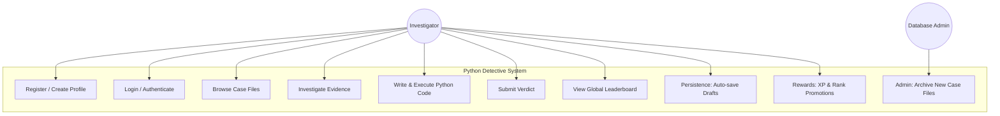
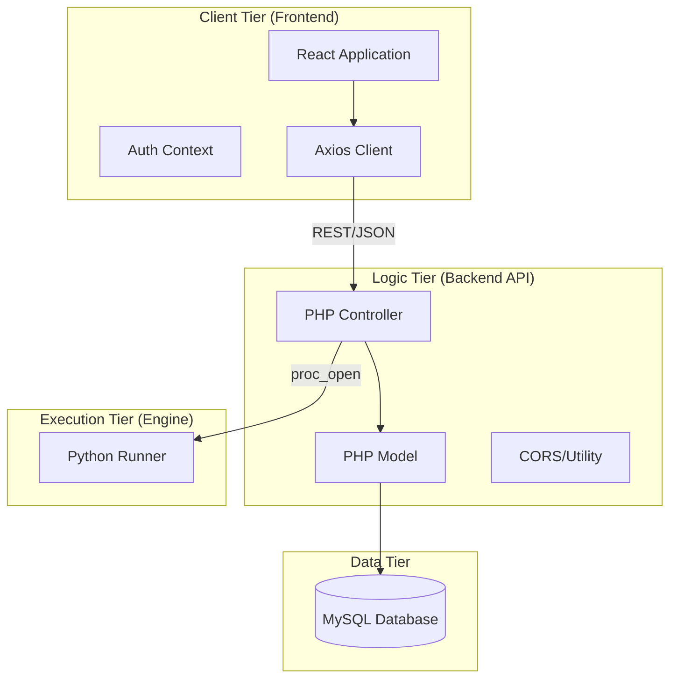
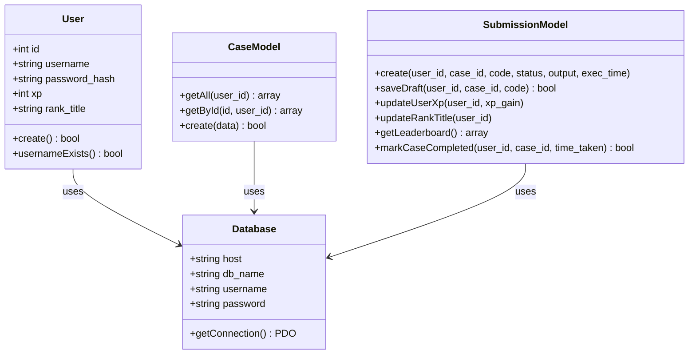
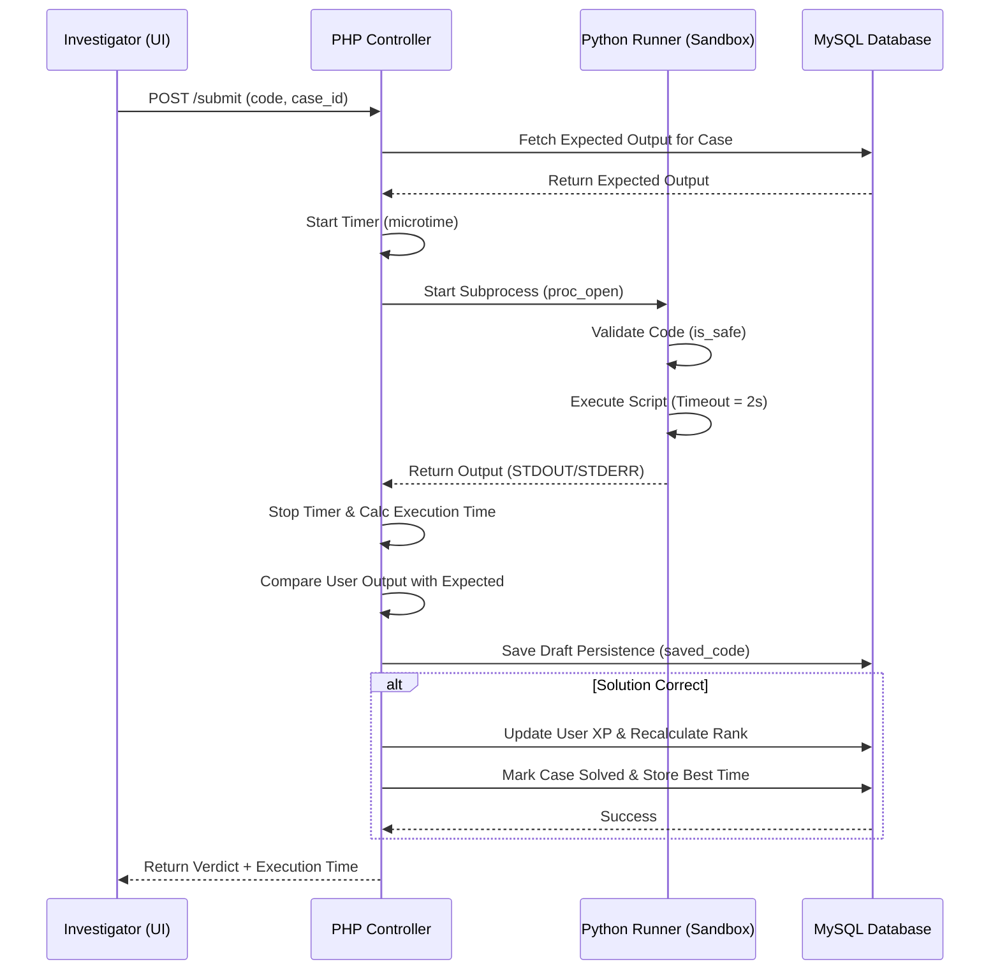
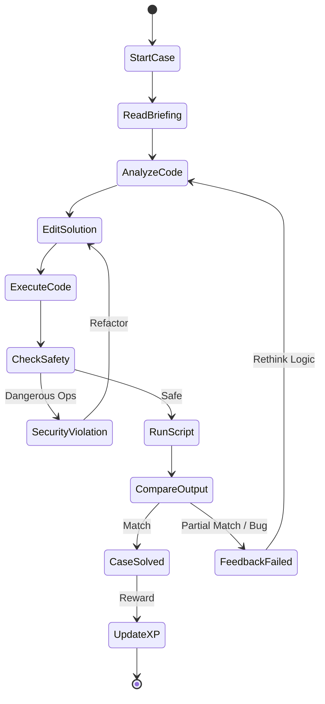
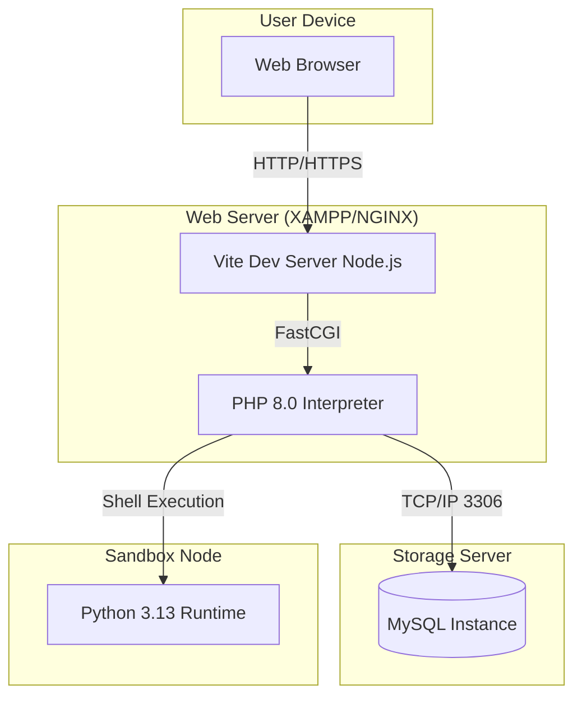

# 📄 Software Requirement Specification (SRS) & Design Document
## Project: Python Detective Game
**Project Category**: Full-Stack Educational Gamification Platform
**Level**: NIELIT A Level Major Project

---

## 1. System Overview
The Python Detective Game is a multi-tier web application designed to teach Python programming through narrative-driven deduction. It employs a **React** frontend for an immersive user experience, a **PHP REST API** for business logic, and a **Python-based Micro-Sandbox** for secure code execution.

---

## 2. Use Case Diagram
Describes the functional requirements from the perspective of the Investigator (User).

---

## 3. System Architecture (Component Diagram)
The system follows a decoupled Client-Server architecture.

---

## 4. Class Diagram
Represents the Object-Oriented structure of the Backend API.

---

## 5. Sequence Diagram: Code Submission Flow
Illustrates the chronological interaction between components during a solution attempt.

---

## 6. Activity Diagram: Game Logic Loop
Detailed logic flow for resolving a detective case.

---

## 7. Deployment Diagram
Hardware and software mapping for the production/development environment.

---

## 8. Development & Planning
- **Phase 1: Database Design**: Implementation of `schema.sql` (Users, Cases, Submissions).
- **Phase 2: Backend Development**: Building the PHP REST API with MVC patterns.
- **Phase 3: Sandbox Engineering**: Creating `runner.py` with security restrictions.
- **Phase 4: Frontend Immersive UI**: React + Tailwind v4 + Framer Motion.
- **Phase 5: Content Creation**: Seeding the 30 logical cases.
- **Phase 6: Advanced Overhaul**: Implementing Administrative panel, Persistence, and Precise Execution Metrics.

---

## 9. Technical Specifications: Major Enhancements
### 9.1 Administrative Subsystem
Built using a custom `AdminDashboard` component, allowing dynamic expansion of the mystery archive via RESTful API.

### 9.2 Persistence Layer
Employs a `saved_code` column in the `user_progress` table, ensuring the **Cyber-Noir** immersive experience is preserved across sessions. 

### 9.3 Performance Metric Engine
Utilizes high-resolution PHP `microtime` and automated rank calculation triggers within `SubmissionModel`.

---

*End of Documentation*